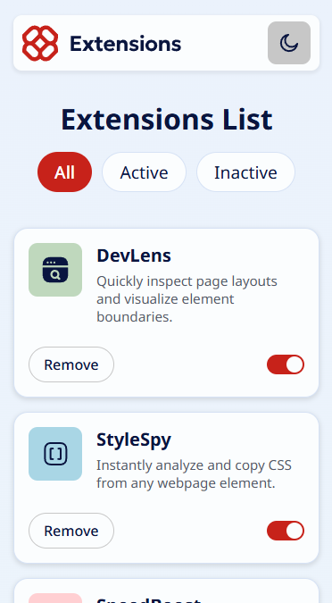
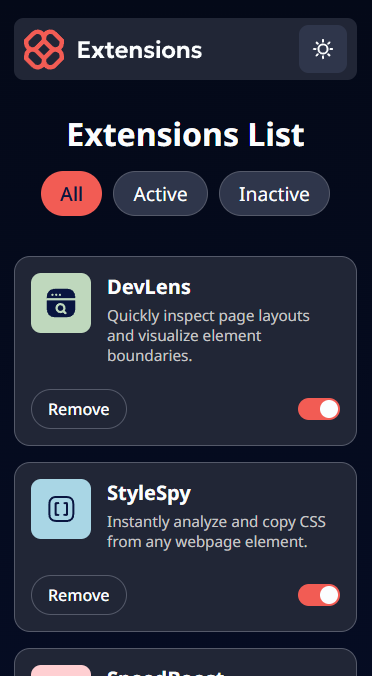
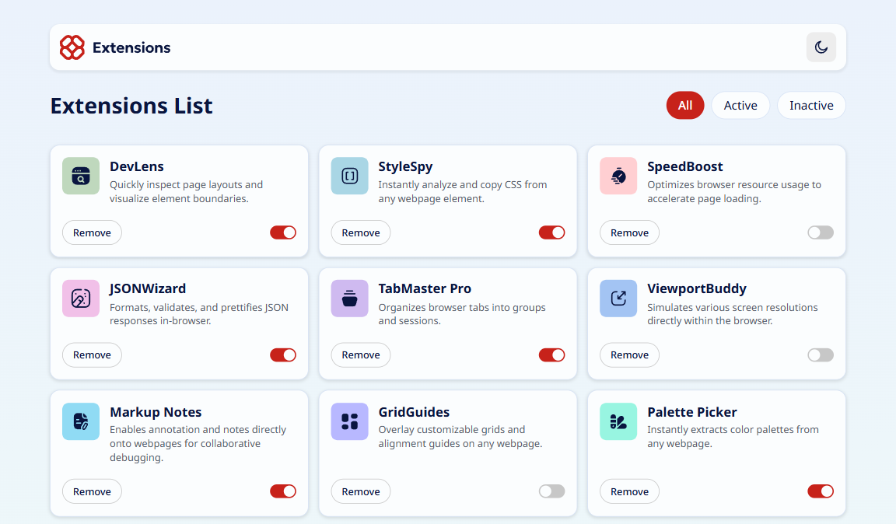
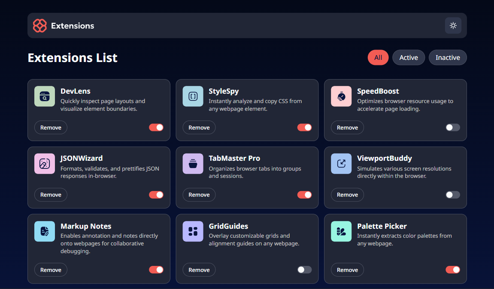

[HTML__BADGE]: https://img.shields.io/badge/html5-%23E34F26.svg?style=for-the-badge&logo=html5&logoColor=white
[CSS__BADGE]: https://img.shields.io/badge/css3-%231572B6.svg?style=for-the-badge&logo=css3&logoColor=white
[JAVASCRIPT__BADGE]: https://img.shields.io/badge/javascript-%23323330.svg?style=for-the-badge&logo=javascript&logoColor=%23F7DF1E

<h1 align="center" style="font-weight: bold;">Gerenciador de extensões</h1>

![html][HTML__BADGE]
![css][CSS__BADGE]
![javascript][JAVASCRIPT__BADGE]

    <a href="#sobre">Sobre</a> • 
    <a href="#tecnologias">Tecnologias utilizadas</a>

    
    

    
    

<h2 id="sobre">📌 Sobre</h2>

Este projeto é um gerenciador de extensões de navegador, onde se pode gerenciar as suas extensões e alternar entre os temas light e dark.

Este projeto foi desenvolvido utilizando as técnicas de "mobile-first" e responsividade, garantindo uma boa experiência em diferentes tamanhos de tela.

A aplicação utiliza um arquivo JSON com dados estáticos para apresentar as extensões em uma lista de cards. Dentro desse sistema o usuário pode:

- Ativar ou desativar as extensões.
- Utilizar o filtro de extensões, que possui três opções de filtro: Todas, Ativas e Inativas.
- Remover extensões da lista.
- Alternar entre temas claro e escuro.

<h2 id="tecnologias">🛠️ Tecnologias Utilizadas</h2>

- **HTML** - Linguagem de marcação padrão para criar páginas web.

- **CSS** - Linguagem de estilos utilizada para definir o estilo visual de documentos HTML.

- **JavaScript** - Linguagem de programação utilizada para adicionar interatividade a páginas web.
